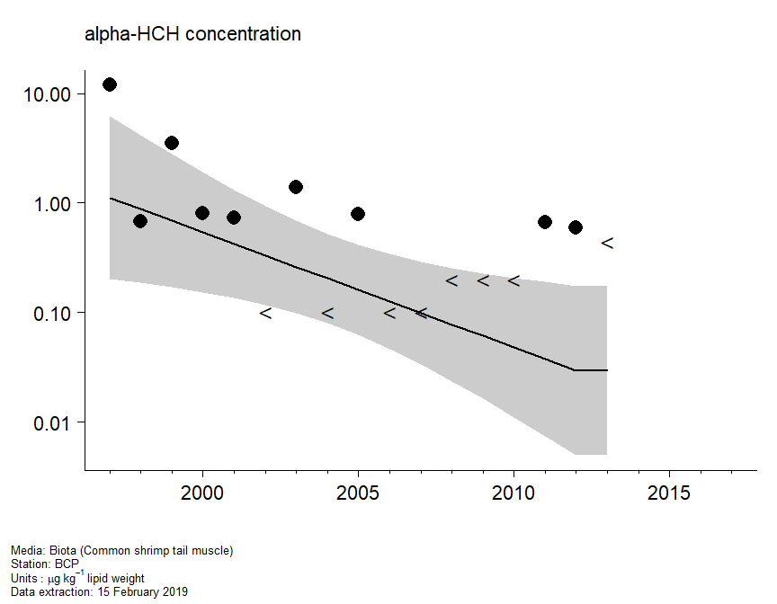
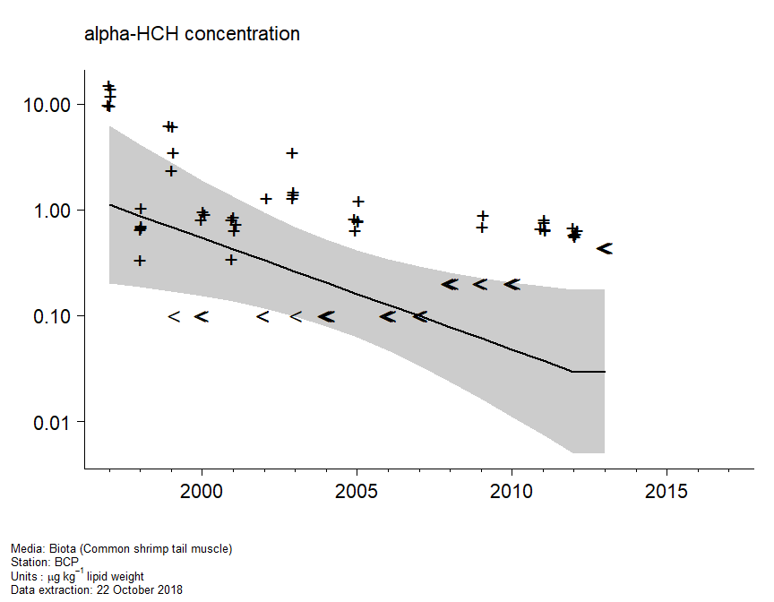
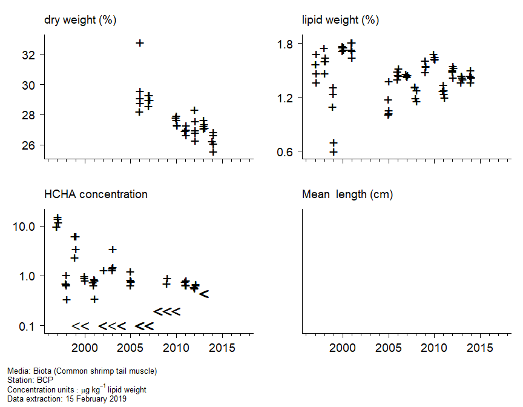
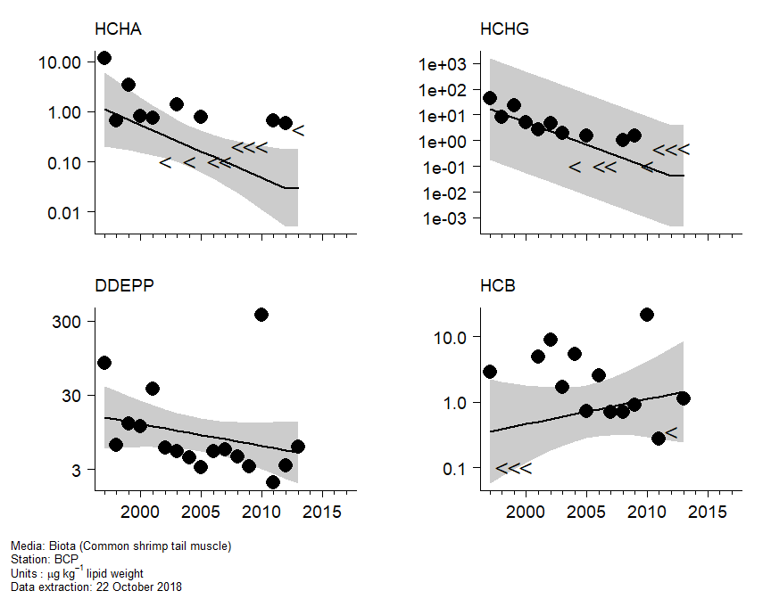
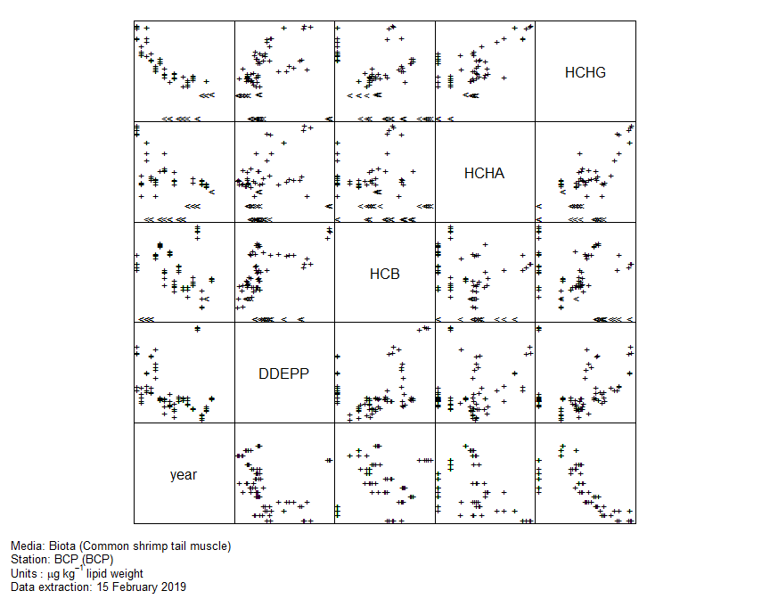

Hazardous substances assessment tool
================

As an example, the code in this repository produces an html version of
the plots and tables shown below.

### Assessment plots

Will put some introductory text here, including summary information
about the time series, including:

  - station name
  - latitude and longitude
  - region
  - MSTAT
  - compartment
  - determinand
  - units
  - species (if biota)
  - matrix
  - extraction date

<br>

#### Assessment plot

<!-- -->

#### Trend with data

<!-- -->

#### Auxiliary data

<!-- -->

#### Assessments (related compounds)

<!-- -->

#### Data (related compounds)

<!-- -->

#### Statistical analysis

<br>

**Trend assessment**

Analysis of
variance

``` 
                Df      AIC     AICc   Log lik Deviance     Chisq Chi df Pr(>Chisq)
mean             1 204.5347 206.7847 -99.26734 198.5347        NA     NA         NA
linear           2 201.9493 206.5207 -96.97464 193.9493 4.5854093      1 0.03224527
smooth (df = 2)  3 198.4669 206.8003 -94.23347 188.4669 5.4823321      1 0.01920961
smooth (df = 3)  4 199.6460 214.0460 -93.82299 187.6460 0.8209623      1 0.36489896
```

<br>

Change in log
concentration

``` 
              Year start Year end  Fit start   Fit end    Change Std error         t   Pr(>|t|)
overall             1997     2013  0.1113085 -3.522523 -3.633832  1.606903 -2.261388 0.05006289
last 20 years       1998     2013 -0.1309469 -3.522523 -3.391576  1.499776 -2.261388 0.05006289
```

<br>

**Status assessment**

No assessment criteria <br>
