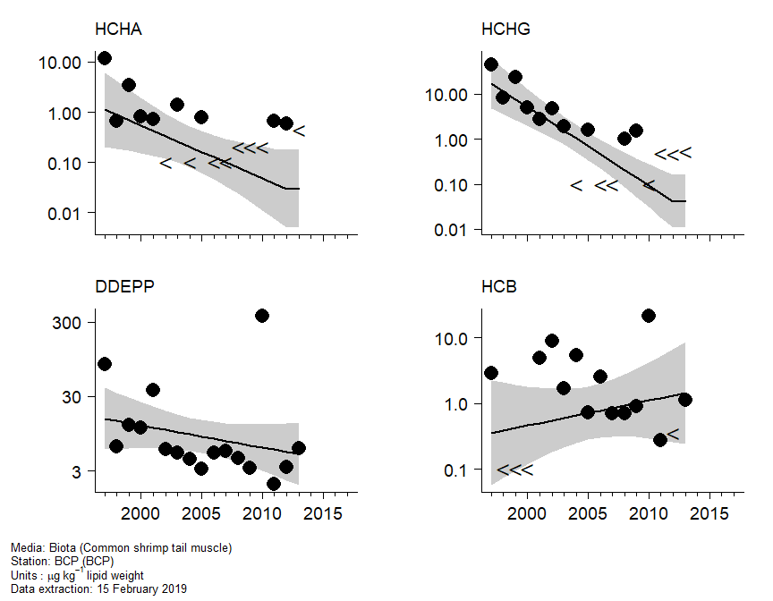

OSPAR Hazardous substances Assessment Tool
================

As an example this markdown document has been produced using the code in
the 2019 folder. In practice, an HTML document is produced, which can be
accessed at the link below:

<https://ocean.ices.dk/OHAT/Home/GettrResult?seriesID=Belgium%20BCP%20HCHA%20Crangon%20crangon&matrix=Biota&year=2019>

The graphical map interface to all assessments can be found here:
<https://ocean.ices.dk/ohat/> or
<http://ices.dk/data/assessment-tools/Pages/ospar-cat-app.aspx>

### Assessment plots and statistical analysis

This report provides details of the assessment of alpha-HCH
concentrations in common shrimp at station BCP.

<ul>

<li class="gap">

Timeseries metadata. Key information about the timeseries.

</li>

<li class="gap">

Assessment plot. The fitted trend (solid line) with pointwise 90%
confidence bands (grey shaded areas). The trend is plotted on the log
scale, with the axis labels back-transformed for ease of interpretation.
The points are the annual medians of the individual log concentration
measurements.

</li>

<li class="gap">

Trend with data. The fitted trend with pointwise 90% confidence bands.
The points are the individual concentration measurements, with a \<
denoting a less-than value.

</li>

<li class="gap">

Auxiliary data. The individual concentration measurements with
supporting information: mean length of the individuals in the sample;
dry weight (%) of the sample; lipid weight (%) of the sample.

</li>

<li class="gap">

Assessment (related compounds). Assessment plots for all the compounds
in the same chemical group.

</li>

<li class="gap">

Data (related compounds). A scatter plot matrix of the individual
concentration measurements for all the compounds in the same chemical
group.

</li>

</ul>

<br>

#### Timeseries metadata

<br>

<ul>

<li>

OSPAR region: 2

</li>

<li>

Region: Southern North Sea

</li>

<li>

Station code: BCP

</li>

<li>

Station name: BCP

</li>

<li>

Station latitude: 51.33

</li>

<li class="gap">

Station longitude: 2.83

</li>

<li>

Media: biota

</li>

<li>

Species latin name: Crangon crangon

</li>

<li>

Species common name: common shrimp

</li>

<li class="gap">

Matrix: tail muscle

</li>

<li>

Determinand code: HCHA

</li>

<li>

Determinand name: alpha-HCH

</li>

<li class="gap">

Units: μg kg<sup>-1</sup> lipid weight

</li>

<li>

Extraction: 15 February 2019

</li>

</ul>

<br>

#### Assessment plot

<!-- -->

#### Trend with data

<!-- -->

#### Auxiliary data

<!-- -->

#### Assessments (related compounds)

<!-- -->

#### Data (related compounds)

<!-- -->

#### Statistical analysis

<br>

**Trend assessment**

Analysis of variance

``` 
                Df      AIC     AICc   Log lik Deviance     Chisq Chi df Pr(>Chisq)
mean             1 204.5347 206.7847 -99.26734 198.5347        NA     NA         NA
linear           2 201.9493 206.5207 -96.97464 193.9493 4.5854093      1 0.03224527
smooth (df = 2)  3 198.4669 206.8003 -94.23347 188.4669 5.4823321      1 0.01920961
smooth (df = 3)  4 199.6460 214.0460 -93.82299 187.6460 0.8209623      1 0.36489896
```

<br>

Change in log concentration

``` 
              Year start Year end  Fit start   Fit end    Change Std error         t   Pr(>|t|)
overall             1997     2013  0.1113085 -3.522523 -3.633832  1.606903 -2.261388 0.05006289
last 20 years       1998     2013 -0.1309469 -3.522523 -3.391576  1.499776 -2.261388 0.05006289
```

<br>

**Status assessment**

No assessment criteria <br>

### how to build this file

this file was created using (requires access to
`assessment_platform.RData`)

``` r
rmarkdown::render("README.Rmd")
```
